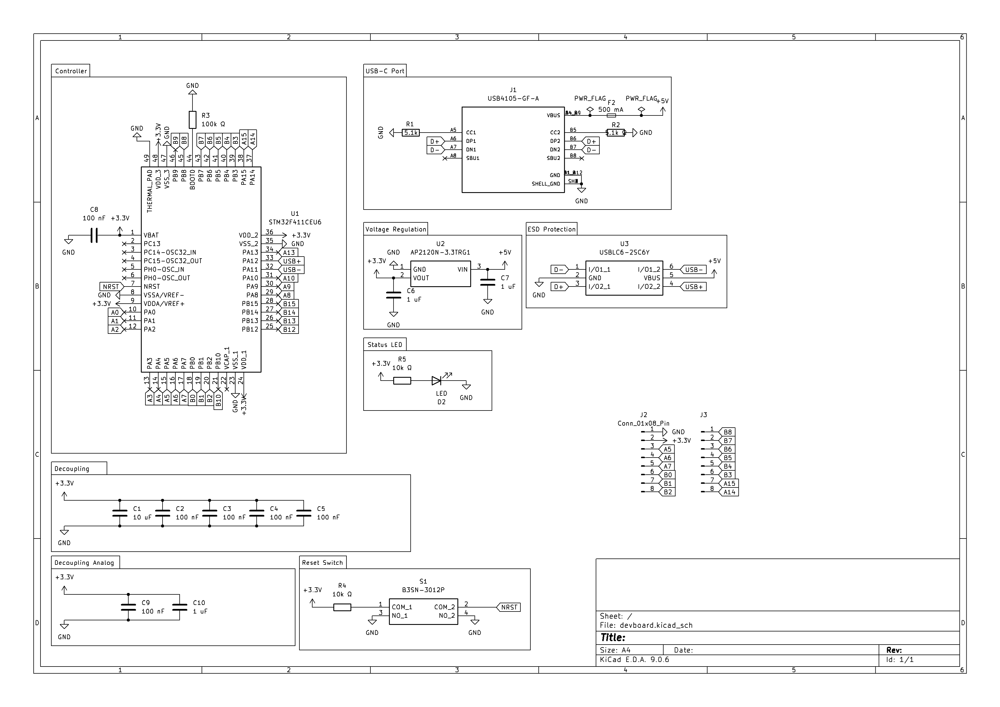
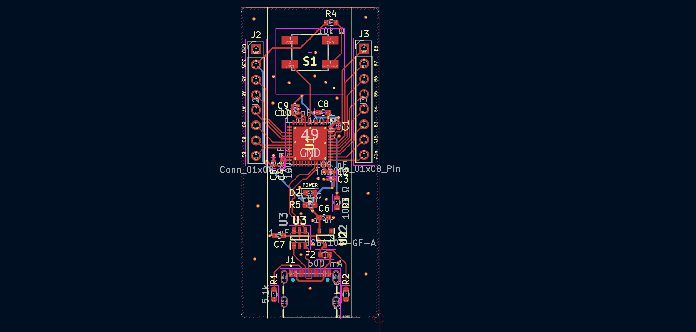
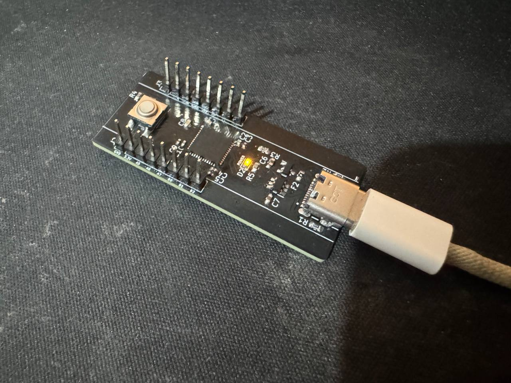

# STM32 Devboard

This is my first serious PCB designed for manufacturing.  
It's a microcontroller development board based on the **STM32F411CEU6**.

---

## 🎯 Project Goals

- [x] Learn basics of schematic organization
- [x] Learn basics of PCB routing and component placement
- [x] Get familiar with PCBWay and Chinese manufacturing
- [x] Achieve plug-and-play support in Arduino IDE via USB-C
- [x] Small form factor, **breadboard-friendly**

---

## 📷 Project Media

  
    
  
    
  

---

## 🧩 MCU Specs (STM32F411CEU6)

- ARM Cortex-M4 @ 100 MHz
- 512 KB Flash, 128 KB SRAM
- USB OTG
- SPI / I2C / UART
- ADC / TIM / DMA

---

## 🛠 Toolchain

- **ECAD:** KiCad
- **Manufacturing:** PCBWay
- **Firmware:** Arduino IDE / STM32 Core
- **Debugging:** SWD

---

## 📦 Status

Power-up tests were successful: power rails are within expected ranges and no shorts were observed. Next step is flashing the initial firmware via ST-Link.
